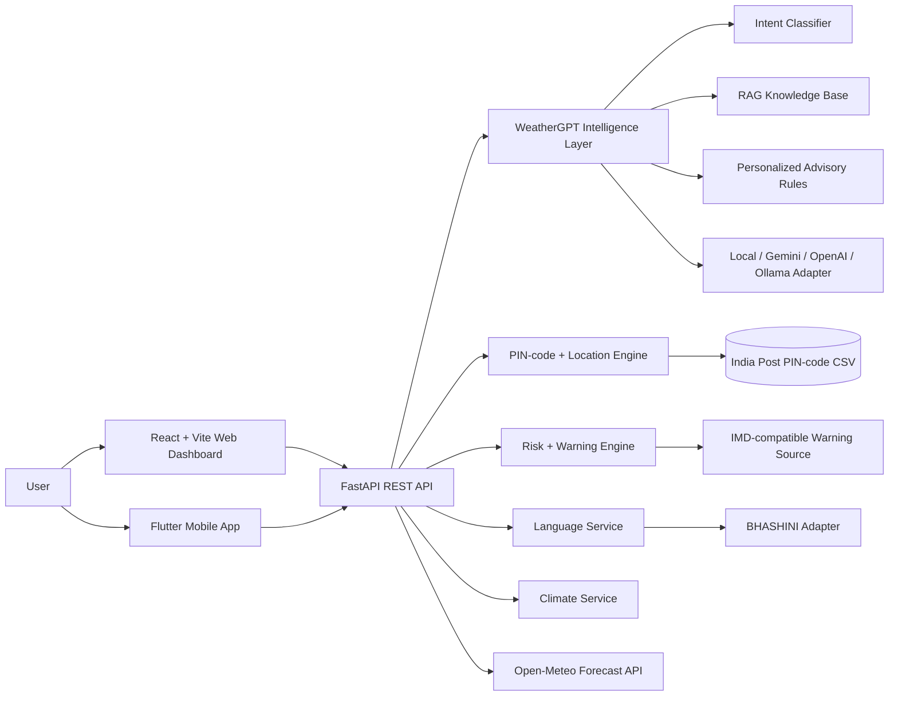
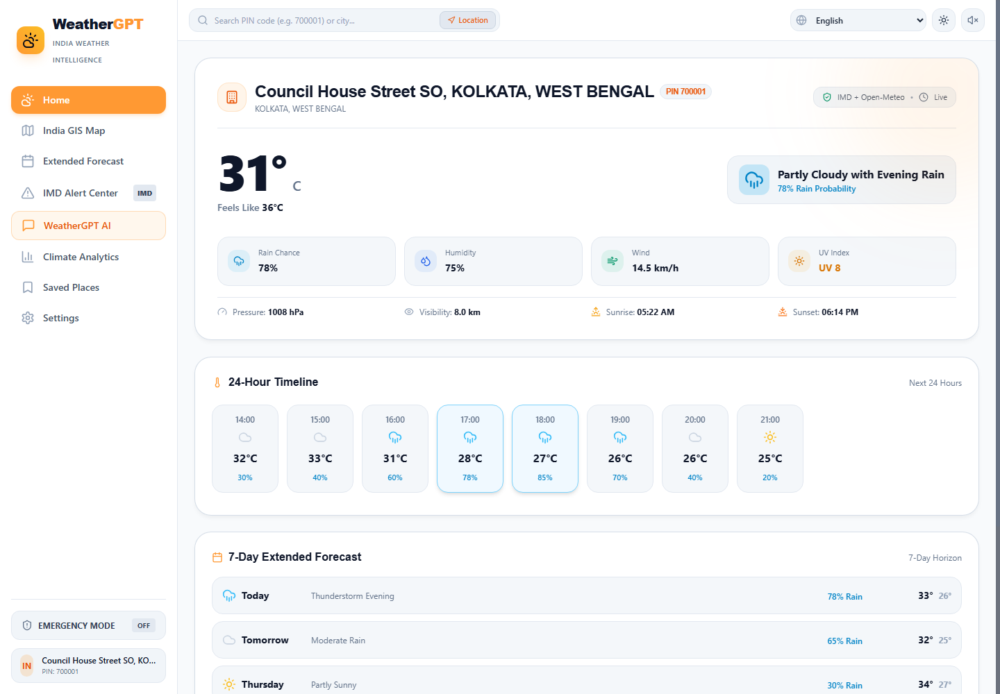
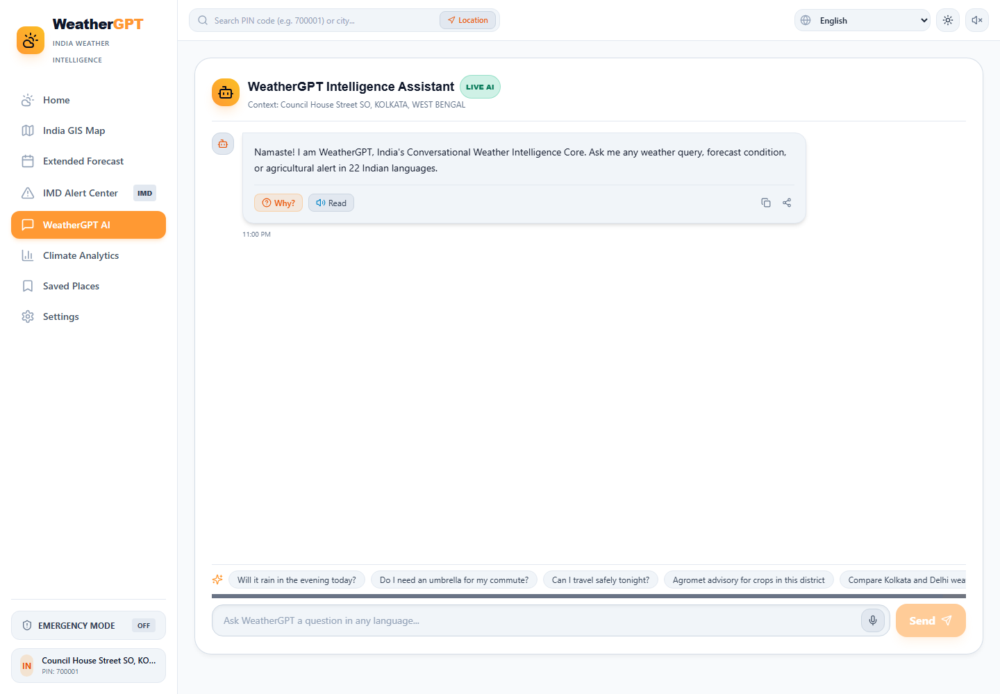
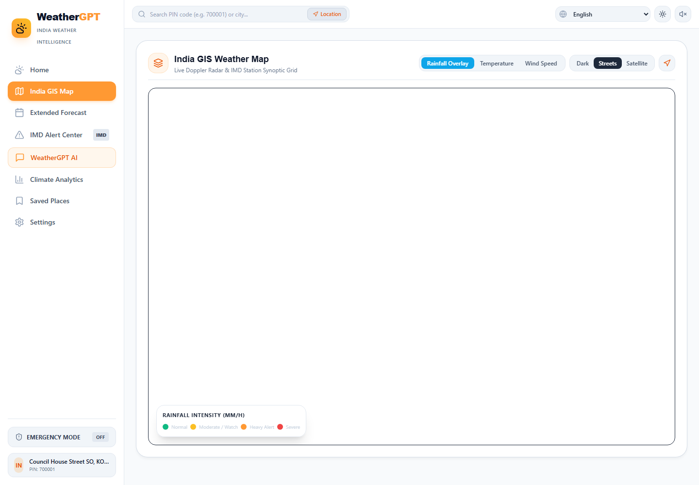
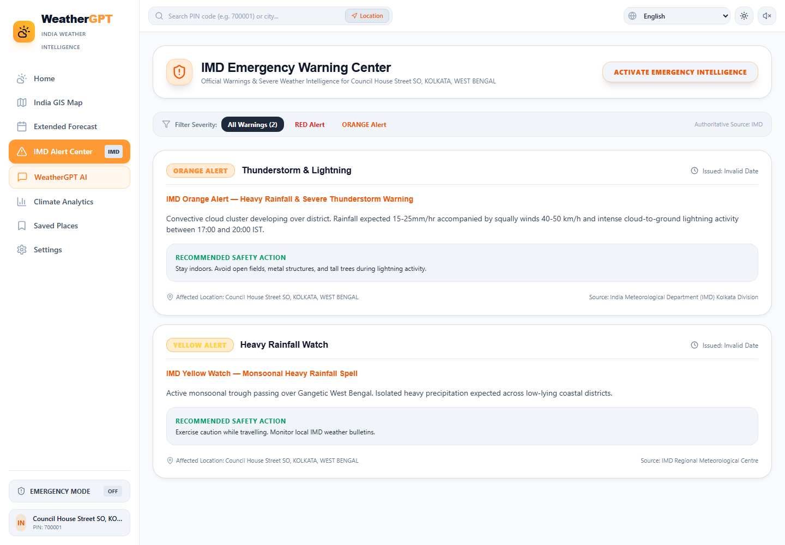
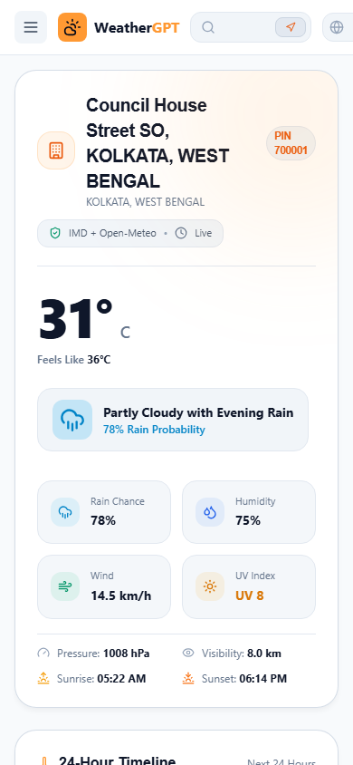
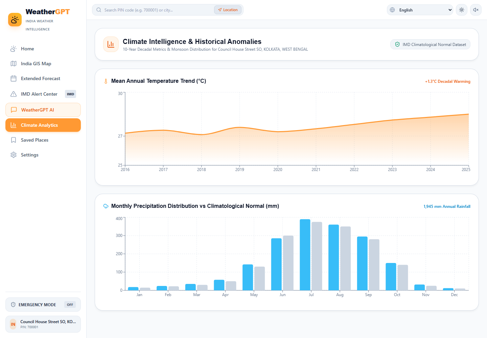

# WeatherGPT

AI-Powered Conversational Weather Intelligence for India

## 1. Problem

Weather information in India is often scattered across maps, alerts, raw forecasts, and technical bulletins. Many citizens need guidance in local languages, by PIN code, or by immediate location rather than by meteorological jargon. Severe-weather warnings are also hard to translate into practical decisions for farmers, commuters, students, outdoor workers, and vulnerable users. Existing tools usually answer "what is the weather" but do not explain "what should I do next." WeatherGPT addresses that gap with conversational, localized, and action-oriented weather intelligence.

## 2. Solution

WeatherGPT is a full-stack weather intelligence platform for India. It combines a FastAPI weather backend, Open-Meteo forecast data, IMD-compatible warning adapters, India Post PIN-code geolocation data, a WeatherGPT advisory layer, BHASHINI-ready translation, an interactive React GIS dashboard, and a Flutter mobile app. Users can ask weather questions conversationally, resolve weather by PIN code or coordinates, inspect map-based conditions, receive risk-aware alerts, and view climate trend intelligence.

## 3. Key Features

```sql
✓ Conversational weather AI
✓ Real-time weather
✓ Forecasts
✓ Weather alerts
✓ PIN-code weather
✓ Location-based weather
✓ Interactive GIS
✓ Multilingual Indian-language support
✓ BHASHINI integration
✓ Voice interaction
✓ Climate intelligence
✓ Personalized advisories
✓ Accessibility
```

## 4. Architecture



## 5. Technology

```kotlin
Frontend
React
TypeScript
Vite
Tailwind CSS
Leaflet / React Leaflet
Recharts
Lucide React

Mobile
Flutter
Dart
flutter_map
http

Backend
Python
FastAPI
Pydantic / Pydantic Settings
HTTPX
Uvicorn
Pytest

AI
WeatherGPT advisory layer
Intent classifier
RAG knowledge base
Risk and advisory rule engine
Optional Gemini / OpenAI / Ollama adapters
Local rule-engine fallback

Weather
Open-Meteo API
IMD-compatible warning adapter
India Post PIN-code dataset

Language
BHASHINI adapter
Offline Indian-language fallback mappings

Maps
Leaflet
OpenStreetMap tiles
flutter_map

Database
Local CSV dataset: data/pincode/pincode.csv

Deployment
Backend Dockerfile
Vite production build
Flutter Android APK build
```

## 6. Screenshots

| Screen | Preview |
|---|---|
| Home |  |
| WeatherGPT |  |
| Map |  |
| Alerts |  |
| Multilingual |  |
| Mobile |  |
| Climate |  |

## 7. Installation

From the repository root:

```powershell
python -m venv .venv
.\.venv\Scripts\Activate.ps1
python -m pip install --upgrade pip
python -m pip install -r backend\requirements.txt
Copy-Item .env.example .env
```

Install the web dependencies:

```powershell
cd web
npm install
cd ..
```

Install the mobile dependencies:

```powershell
cd mobile
flutter pub get
cd ..
```

## 8. Environment Variables

Use `.env.example` as the template:

```dotenv
APP_ENV=development
DEBUG=true
PORT=8000
HOST=0.0.0.0
CORS_ORIGINS=["*"]

IMD_API_KEY=
IMD_BASE_URL=https://mausam.imd.gov.in/api

OPEN_METEO_BASE_URL=https://api.open-meteo.com/v1

DEFAULT_LLM_PROVIDER=local

GEMINI_API_KEY=
GEMINI_MODEL=gemini-1.5-flash

OPENAI_API_KEY=
OPENAI_MODEL=gpt-4o-mini

OLLAMA_BASE_URL=http://localhost:11434
OLLAMA_MODEL=llama3

BHASHINI_USER_ID=
BHASHINI_API_KEY=
BHASHINI_PIPELINE_ID=
BHASHINI_BASE_URL=https://dhruva-api.bhashini.gov.in/services/inference/pipeline

PINCODE_DATA_PATH=data/pincode/pincode.csv
```

## 9. Running Locally

Start the backend from the repository root:

```powershell
$env:PYTHONPATH = "backend"
python -m uvicorn app.main:app --reload --host 0.0.0.0 --port 8000
```

API docs:

```text
http://localhost:8000/docs
```

Start the web app:

```powershell
cd web
npm run dev
```

Web app:

```text
http://localhost:3000
```

Run the Flutter app:

```arduino
cd mobile
flutter pub get
flutter run
```

Run backend tests:

```powershell
python -m pytest backend/tests
```

Build the web app:

```powershell
cd web
npm run build
```

## 10. APK

The Android APK is built from the Flutter project in `mobile/`.

```powershell
cd mobile
flutter build apk --release
```

The release APK is generated at:

```text
mobile/build/app/outputs/flutter-apk/app-release.apk
```

Build artifacts are intentionally ignored by git. Rebuild the APK from source whenever you need a fresh distributable.

## 11. Live Demo

Later put:

```text
Web: [https://weathergpt-coral-psi.vercel.app/]
```

## 12. Video

Later:

```text
Demo Video: YouTube URL
```

## 13. Team

Soumen Mishra [Soumen044](https://github.com/Soumen044)
Dwaipayan Ch. Adhikary   [mailto:dwaipayanchaadhikaryy@gmail.com]
Ashok Kumar Mahata
Subham Patra
Tarini Sankar Sau
Sandhya Manna


ashokmahata52@gmail.com
subhampatr2006@gmail.com
tarinisankarsau750@gmail.com
sandhyamanna19@gmail.com

Project: WeatherGPT - AI-Powered Conversational Weather Intelligence for India
